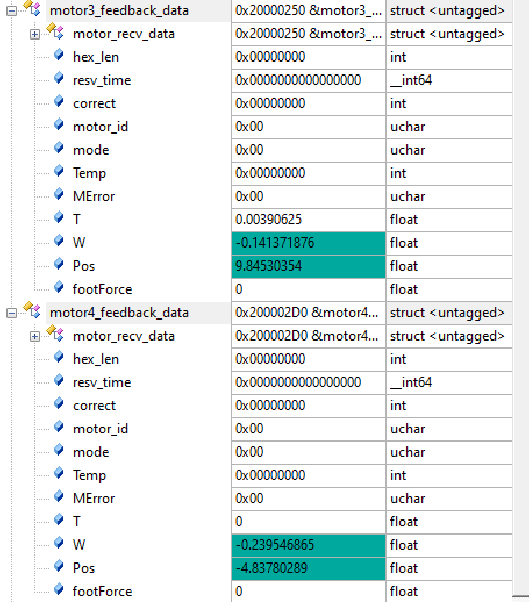
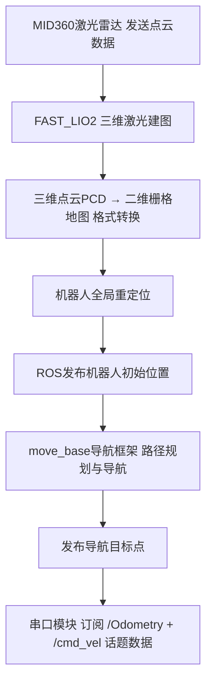

# ROBOCON-BRS_robot/黑岩射手
ROBOCON is a top-tier robotics competition that places high demands on mechanical reliability, electronic control stability, and visual accuracy.

ROBOCON作为机器人领域的顶尖赛事，对机械可靠性、电控稳定性、视觉准确性提出了较高的要求。

In the 2025 season, I was responsible for the full-stack R&D of the quadruped robot team, covering mechanical modeling, motion control, and autonomous navigation. Utilizing a carbon tube assembly mechanism similar to plant protection drones, force control algorithms, and 3D LiDAR mapping & navigation technology, our team achieved 30th place in the Speed Race, 31st in the Obstacle Race, and 34th in the Cross-Country Race at the 2025 ROBOCON (Jiangyin) among over 180 participating teams, winning Second Prize nationally in all three categories.

在2025赛季我基本完整负责了足式机器人一队从机械建模、运动控制到自主导航的全栈研发，采用类植保无人机碳管装配工艺机构+力控制算法+3D雷达建图导航技术，取得2025年ROBOCON（江阴）足式机器人竞速赛全国30名、障碍赛全国31名、越野赛全国34名（全国赛参赛队伍180余支）共三项国二的良好成绩。

Post-calculation Visualization of Trajectory Demonstration and Inverse Kinematics Solution Demonstration in MATLAB

MATLAB计算后可视化的轨迹演示以及其逆解算演示

The system architecture diagram is shown in the figure.

系统架构图如图所示

Data Reading Demonstration in Calibration Mode

校准模式的数据读取演示

# Project Timeline/项目时间线：

- August 2024: Project initiation

- December 2024: Completion of the first version of the mechanical prototype

- February 2025: Completion of the first version of the slave computer

- April 2025: Completion of the master computer

- June 2025: Completion of the navigation function

- July 2025: Completion of the second version of the slave computer; participation in the competition in the same month

- 2024年8月 项目启动 

- 2024年12月 完成第一版机械实物 

- 2025年2月 完成第一版下位机 

- 2025年4月 完成上位机 

- 2025年6月 完成导航功能 

- 2025年7月 完成第二版下位机 同月参赛。

  

# Update Log/更新记录：

- November 2025: Open-source mechanical structure
- December 2025: Open-source slave computer control software
- 2025年11月 开源机械结构
- 2025年12月 开源下位机控制软件
- ……

# Project Acknowledgements

Host computer

- https://github.com/66Lau/NEXTE_Sentry_Nav

- [使用mid360从0开始搭建实物机器人入门级导航系统，基于Fast_Lio,Move_Base](https://blog.csdn.net/weixin_52612260/article/details/134124028)
- [基于Mid360、FAST-LIO2（建图）与MOVE-BASE（导航）的串口发送方案](https://blog.csdn.net/Hbutneymar/article/details/147161479)

Slave computer

